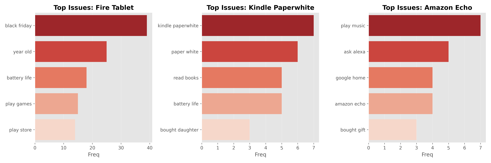
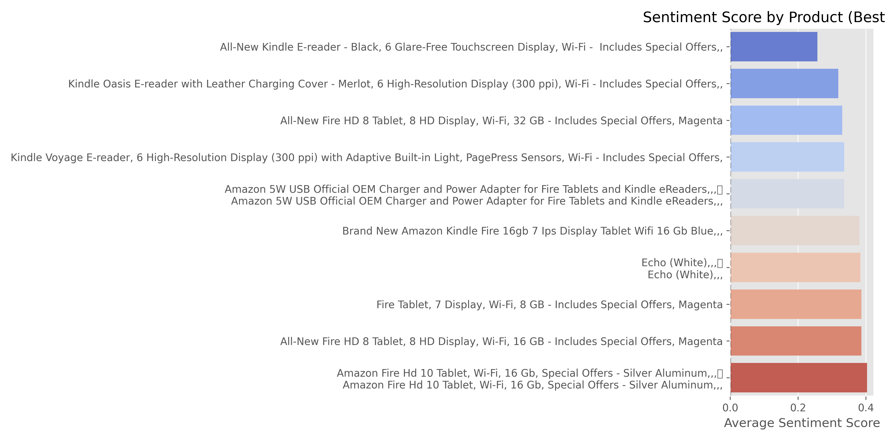
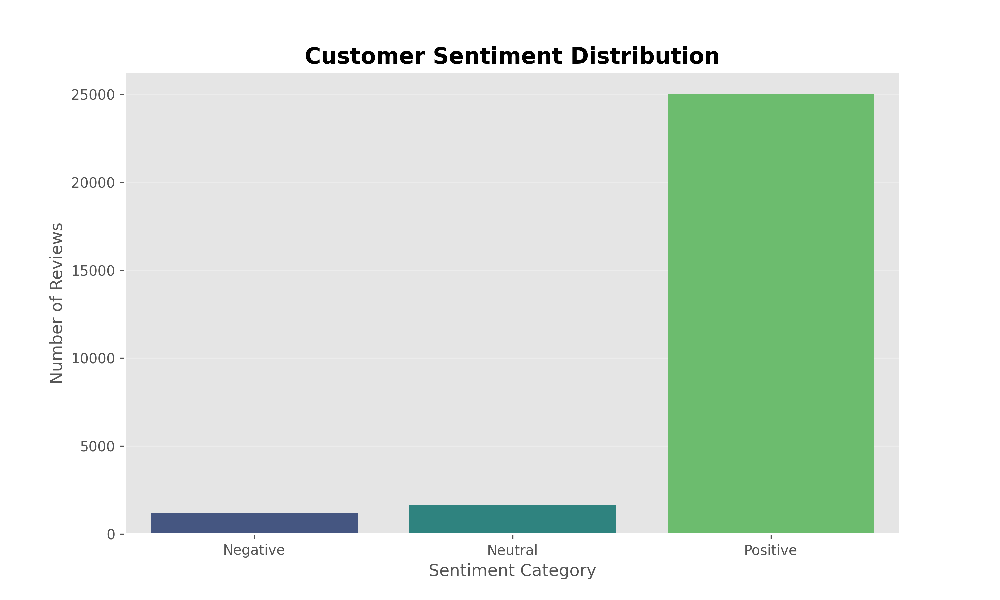

# 🗣️ Voice of Customer: E-Commerce Sentiment Analytics

### 📊 Project Highlights
Here are the visual insights generated from the analysis:

**1. Root Cause Diagnosis (Per Product)**

**2. Product Segmentation (Best vs. Worst Performers)**

**3. Overall Sentiment Distribution**

---

### 📌 Project Overview
In e-commerce, a 4.5-star rating can hide fatal flaws. A product might be rated highly for *price* but fail consistently on *durability* after 1 year.

Using **Natural Language Processing (NLP)** and **Python**, I analyzed 34,000+ customer reviews to decode the "Why" behind the ratings. I moved beyond simple "Positive/Negative" counting to identifying specific **Root Causes** per product SKU.

### 🔍 Key Business Discoveries
My analysis uncovered critical actionable insights that raw ratings missed:

| Product | The Hidden Problem (Root Cause) | Strategic Recommendation |
| :--- | :--- | :--- |
| **Fire Tablet** | **"Play Store" & "Year Old"** Customers are frustrated by the lack of Google Play Store ecosystem and hardware failure right after warranty expires. | **Product Strategy:** Re-evaluate OS limitations or improve app ecosystem transparency in marketing. |
| **Amazon Echo** | **"Google Home"** Negative reviews frequently mention the competitor, indicating a direct comparison where users feel Google's AI is superior. | **Competitive Intel:** Benchmark AI responsiveness against Google Home specifically for music commands. |
| **General** | **"Black Friday"** A massive spike in negative sentiment was linked to shipping chaos during sales events, not product defects. | **Logistics:** Scale up support & logistics capacity during Q4 peak seasons. |

### 🛠️ Tech Stack
* **Python:** Data Manipulation & Cleaning
* **NLTK & TextBlob:** Sentiment Scoring & Subjectivity Analysis
* **Scikit-Learn:** N-Gram extraction (Bigrams) for context mining
* **Matplotlib/Seaborn:** Advanced Data Visualization

### 🚀 Advanced Techniques Used
1.  **Irony Detection:** Identified "5-Star" reviews with negative sentiment (Sarcasm/User Error) to clean training data.
2.  **Subjectivity Analysis:** Separated "Fact-based complaints" (Broken screen) from "Feeling-based complaints" (Ugly color).
3.  **Cross-Tabulation:** Mapped specific text phrases to specific Product IDs to pinpoint defects at the SKU level.

---
*Created by Adin W Pratama - Full Stack Data Analyst Portfolio*
